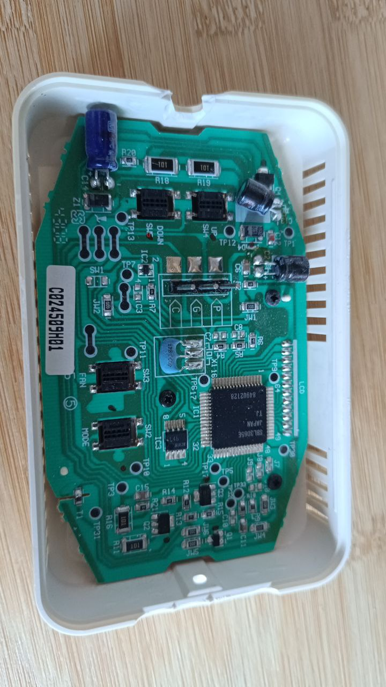
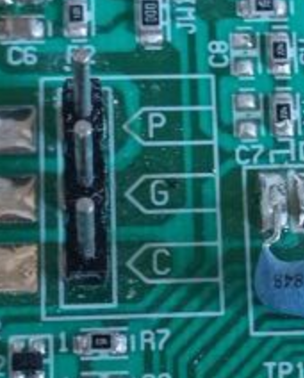
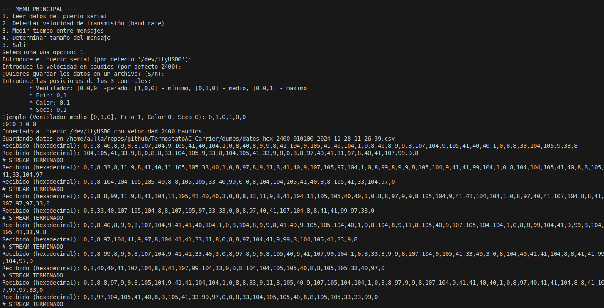

# TermostatoAC-Carrier

[English](README.md) Version inglés

-----

**ÍNDICE**

- [TermostatoAC-Carrier](#termostatoac-carrier)
  - [Introducción](#introducción)
  - [Descripción del termostato](#descripción-del-termostato)
  - [Componentes a utilizar](#componentes-a-utilizar)
  - [Software](#software)
  - [Lecturas de datos](#lecturas-de-datos)

-----

## Introducción

Este proyecto pretende solucionar la falta de actualizaciones para el termostato de una conocida marca de aire acondicionado americana mediante su sustitución por un dispositivo compatible que, además, permita ampliar las opciones de programación, acceso remoto y una interfaz más moderna.

## Descripción del termostato

Este proyecto trata con el termostato **CRC2-NTC** de Carrier. Se trata de un termostato obsoleto que la propia empresa ya no provee.




Aún se pueden encontrar las instrucciones de instalación y para el usuario en internet. Adjunto dos enlaces para verlas:

[Manual de Instalación](https://www.manualslib.com/manual/2206657/Carrier-Crc2-Ntc.html)
[Manual de Usuario](https://www.manualslib.com/manual/2206660/Carrier-Crc2-Ntc.html) 

Dentro del manual de instalación podemos encontrar la siguiente imágen, que nos permite entender como tratar los tres elementos de conexión:



En este caso, nos encontramos con tan solo 3 pins de conexión:
 * **P**: para Power con 12v
 * **G**: para GND
 * **C**: para la emisión de datos --> a la entrada B- del adaptador.

El termostato emite cada X tiempo una serie de datos que son aquellos que queremos analizar para poder entender el funcionamiento del sistema. 

## Componentes a utilizar

Para poder realizar las lecturas del termostato utilizo el siguiente adaptador:


Lo compré en Aliexpress en esta tienda [Adaptador USB to RS485](https://es.aliexpress.com/item/1005006111904749.html?spm=a2g0o.order_list.order_list_main.85.4fd6194dqfCvY1&gatewayAdapt=glo2esp)


## Software

### Permisos dispositivo
Para acceder al dispositivo USB sin sudo es necesario ejecutar el siguiente comando:
sudo usermod -a -G dialout **username**


## Lecturas de datos
Las lecturas se generarán en la carpeta dumps.
Usaremos el comando:
```
python3 USB2RS485.py
```


## Entrenamiento IA.

Cuando ya tengas suficientes ficheros en dumps, puedes empezar a entrenar a tu IA.
```
python3 trainning_tools.py entrenar epocas=20000
```
Las opciones disponibles son:
 - entrenar: Permite entrenar un modelo.
 - prediccion: Se facilita una trama o fichero e intenta predecir el estado.

 ### Entrenar.
 ```
python3 trainning_tools.py entrenar epocas=20000
```
 * epocas=. Son las epocas a cursar.
 * modelo=. Opcional. Se especifica un fichero que continee un modelo entrenado.Si el modelo no se especica, se crea uno nuevo.
 * dataset=. Opcional. Carpeta que contienen los dumps a usar como entreno.Si el modelo no se especifica se usa carpeta dums.
 * layers=. Opcional. Numero de capas cuando el modelo es nuevo. Por defecto 1.
 * neuronas=. Optional. Numero de neuronas en capas intermedias. Por defecto 10.
 * save. Opcional. Guarda el modelo entrenado en la carpeta models.

 ### Prediccion
 ```
python3 trainning_tools.py prediccion modelo=models/modelo_20241128_120059_10.keras trama=0,0,8,8,97,9...
```
 * modelo=. Fichero del modelo entrenado que vamos a usar para la predicción.
 * trama=. Opcional. Trama a hacer predicción.


 
 
  


